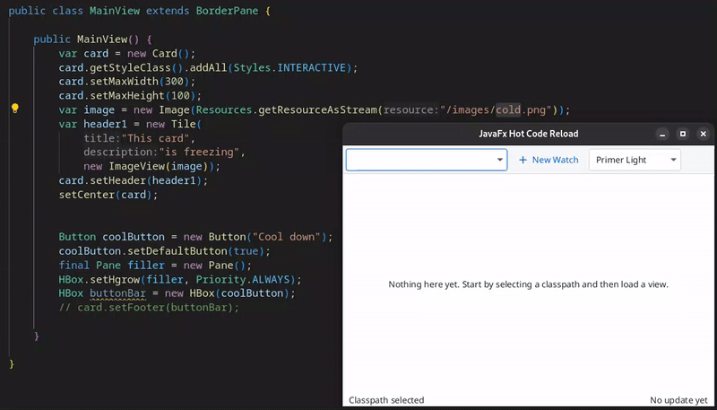
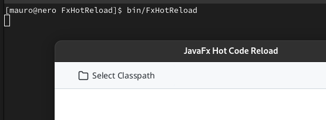

# JavaFx Hot Code Reload
This is a simple tool that provides hot code reload functionality for JavaFx UI components. Just select the classpath and provide the name of the classes to watch. When a watched class is rebuilt it's changes are immediately displayed.

## Requirements
Any IDE that immediately compiles the JavaFx code to class files will do. Just make sure the classes use only the default JavaFx API's and have no dependencies on 3rd party packages. Keep in mind that views should just be views and 
should be coupled loosely to the rest of the application.  

## How does this compare to Scenebuilder?
Both projects provide an interactive way to create visual components. While Scenebuilder provides a drag 'n drop appraoach that result in FXML files, this project requires you to code Java files. The direct feedback allows for easy 
tweaking and poitioning. Of course nothing is preventing you from using FXML here as well to create your views. But what is the point? I think there are benefits to having a fully Java coded UI.

## Some notes
- I've created this for fun (and so I can avoid having to use Scenenbuilder).
- My next project will definitely use [AtlantaFx](https://github.com/mkpaz/atlantafx) (Scenebuilder has some trouble supporting custom themes, I'm _not_ going that route. This is the way).
- It's tailored to use AtlantaFx themes and icons. So deviating from this requires changes to the module-info.java.
- Builds will be provided as self contained archive using Jlink.
- ... and more to come.

## Howto run
Download the latest release [here](https://github.com/mfdewit/javafx-hot-reload/releases) and extract the zip file to your location of choice. 
Then run the application from the unzipped directory:

`$ bin/FxHotReload`

